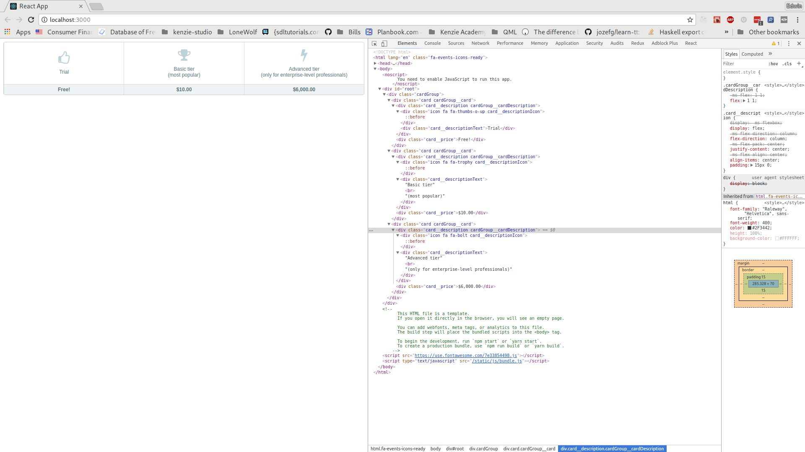

# Assessment: React Cards

For this assessment, you will be revisiting the cards you made for
[this](https://my.kenzie.academy/courses/4/assignments/160?module_item_id=260)
assessment. In doing so, will become more proficient at:

- breaking down a monolithic component into smaller, composable components
- writing JSX and interpolating JavaScript values into HTML fragments
- passing [props](https://reactjs.org/docs/components-and-props.html#props-are-read-only)
  to different components

## Getting Started
To get started, _fork_ this repository into your own GitHub account then clone
this repository to your local machine:

```console
foo@bar:~ $ git clone git@github.com:github-username/react-cards
foo@bar:~ $ cd react-cards
foo@bar:~/react-cards $
```

Note `github-username` above. In other words, __don't__ simply copy-paste the
code above blindly into a terminal. 

We've removed any boilerplate that was not essential to this project. As such,
the two key files in this project are:

- [src/index.css](src/index.css): Contains all the CSS ported from the original
  [Flexbox Cards](https://my.kenzie.academy/courses/4/assignments/160?module_item_id=260)
    assessment
- [src/App.js](src/App.js): Contains the monolithic `App` component that needs
  to be broken down. You should _only_ modify this file, but knowing about
  `index.css` may help you gain an understanding of how things are wired
  together.

You should now be able to run `yarn start` from a terminal and see the familiar
cards appear in your browser:



## Acceptance Criteria
_Note: Please see the rubric on Canvas for detailed breeak down on how this
assessment is being graded. The information below is provided for your
convenience._

### Step 1: Use the `CardGroup` component inside of the `App` component (2 points)
We've already written a `CardGroup` component for you. You might however, have
noticed that we _aren't_ using it anywhere. That is your first task. Take a look
at the implementation for `CardGroup` and create an instance of it inside of
`App`, replacing the necessary HTML as you do. 

Hint: Take a look at class names.

### Step 2: Implement a `Card` component (6 points)

We've stubbed out a dummy implementation for the `Card` component. replace the
`div` with a proper implementation. That implementation should take the
following props:

- `description`: A string which is the text to appear in the
  `.card__descriptionText` div. Example: "Trial".
- `hint`: An optional string which is the text to appear in parentheses after a
  description. Example: "most popular"
- `icon`: A string which is the font-awesome class to use for the
  `.card__descriptionIcon` div. Example: "fa-trophy".
- `price`: A string which is the price to be listed on the card. Example:
  "$6,000.00"

Hint: Conditionally rendering will be covered in detail later, but here's an
example of conditionally showing text if it's provided:

```jsx
const Hello = props => (
    <div>
        <h1>Hello, there!</h1>
        {props.message && <p>{props.message}</p>}
    </div>
);

const App = () => (
    <div>
        <Hello />
        <Hello message="Pleased to meet you!" />
    </div>
);
```

The above would result in the following HTML:

```html
    <div>
        <div>
            <h1>Hello, there!</h1>
        </div>
        <div>
            <h1>Hello, there!</h1>
            <p>Pleased to meet you!</p>
        </div>
    </div>
```

[Here's](https://jsfiddle.net/80oe9svv/) a runnable version if you'd like to
play around with it.

The line with `&&` in it basically reads as: "If there's a message, render a
paragraph with that message". You can use the same trick to conditionally render
a break tag and a hint after it if a hint is provided.

## Step 3: Use the `Card` component inside of the `App` component (2 point)

You should now be able to replace all of the cards inside the `CardGroup`
component that you used in step 1 inside of app. When it's all said and done,
you should see 1 instance of the `CardGroup` component and 3 instances of the
`Card` component. There should be __no__ elements with `className` left inside
of the `App` component. In other words, all those `div`s with `className`s in
them should be encapsulated inside of the `Card` and `CardGroup` components.

## More Hints

Here are a few hints to help you along the way.

### Minimal Imports
You'll notice that we've changed the import line from this:

```jsx
import React, { Component } from "react";
```

To this:

```jsx
import React from "react";
```

We will eventually explain how ES6 [import syntax](https://developer.mozilla.org/en-US/docs/Web/JavaScript/Reference/Statements/import)
works, but the short version for now is that we aren't using `Component`
anywhere, so there is no need to import it. We also prefer to use the shorter
version when using classes, as the expanded version is technically more typing
and leads to confusion. That is, instead of `class App extends Component`, we
prefer `class App extends React.Component`.

### Functional Components

As you look at [src/App.js](App.js), you'll notice that not a single class is
defined. The reason for this is that none of the components take state. As such,
a component that looks like this:

```jsx
class Text extends React.Component {
    render() {
        return (
            <h1>Hello, <span style={{ color: this.props.color }}{this.props.value}</span></h1>
        );
    }
}
```

Can be rewritten as:

```jsx
const SomeComponent = props => (
    <h1>Hello, <span style={{ color: props.color }}{props.value}</span></h1>
);
```

By utilizing [ES6 destructuring assignment](http://es6-features.org/#ObjectMatchingShorthandNotation)
we can reduce that further, still:

```jsx
const SomeComponent = { props, color } => (
    <h1>Hello, <span style={{ color }}{ value }</span></h1>
);
```

### Self-Closing Tags

You may have also noticed that some tags are self closing. Something like this:

```jsx
<div className="icon fa fa-bolt card__descriptionIcon" />
```

The reason for this is that if you have an element that doesn't have children
(such as this empty `div`), then you should prefer to instead write it as a
self-closing tag when writing JSX. 

### `className`
Because JSX is technically JavaScript, all [reserved words](https://www.w3schools.com/js/js_reserved.asp) 
are off-limits for use as props. As such, `class` has been renamed `className`.
Another common one that you may see in the future is `htmlFor`, which replaces a
label's `for` attribute. See [Differences In Attributes](https://reactjs.org/docs/dom-elements.html#differences-in-attributes)
for a more exhaustive list of differences.

### Errors and Warnings

Pay attention to the terminal after running `yarn start`. It'll display errors
and warnings with your code, which is a convenient way to get feedback without
having to switch to a browser first.

## Bonus (0 points)

If you find yourself with extra time (e.g., don't have other assessments to
catch up on), you may consider improving the quality in a number of ways:

- The `Card` component can be broken down into further components that use
    `props.children` like `CardGroup` does. Experiment with doing so.
- Now that they are broken down, compare/contrast benefits of having done so.
  Does using smaller components lead to more boilerplate when using the
  comopnents? Are there any benefits to taking `children` over regular
  `props`?
 - At the moment, the three cards are hard-coded. See if you can work out how to
   take an array of objects consisting of a description, icon, and price, and
   generate `Card` components dynamically from them. Hint.
   [Array.prototype.map](https://developer.mozilla.org/en-US/docs/Web/JavaScript/Reference/Global_Objects/Array/map) 
   will be your friend here.

## Submission

This morning, you learned how to deploy a React app to GitHub Pages, so you
__will__ be required to submit a deployed application today. If you instead
submit a link to a GitHub repository (that is, only code), you _will_ be awarded
__0__ points.
